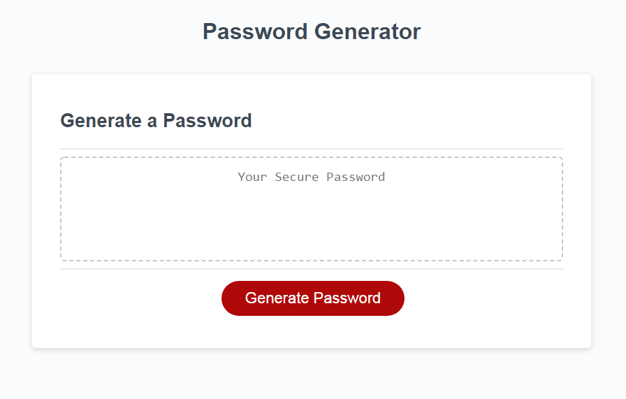

# Password-Generator

A simple password generator.

This project was created as an exercise in Javascript. It is meant to show use of functions, objects, and basic DOM manipulation.

## Usage

Click the button to generate a random password. Pop-ups will prompt for various configurations. Follow the directions on the screen to select criteria for the new password.

## Links

